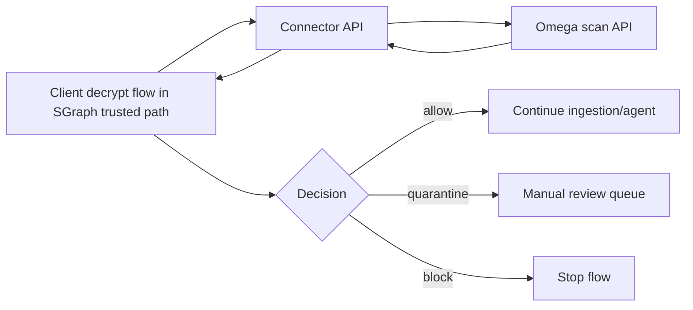

# SGraph Send × Omega Walls Connector

[](contracts/openapi/connector-v1.yaml)
[](connector/)
[](tests/)
[](docs/CONTRACT.md)
[](LICENSE)

Connector repository between [SGraph Send](https://github.com/the-cyber-boardroom/SGraph-AI__App__Send) and [Omega Walls](https://github.com/synqratech/omega-walls), without changing either upstream codebase.

## Why this repo exists

- keeps integration glue isolated from product repos,
- defines one explicit contract between systems,
- provides reproducible local/full-loop environment,
- includes patch kit for upstream PRs on each side.

## Architecture at a glance



Detailed architecture, stage map, and responsibilities:

- [docs/INTEGRATION_ARCHITECTURE.md](docs/INTEGRATION_ARCHITECTURE.md)

## API surface (v1)

- `GET /healthz`
- `POST /v1/scan/attachment`
- `POST /v1/scan/attachment/document_scan_report` (debug, env-gated)

Source of truth:

- [contracts/openapi/connector-v1.yaml](contracts/openapi/connector-v1.yaml)

## Contract summary

Request core:

- `tenant_id` (required),
- `request_id` (optional),
- one of: `file_base64` or `extracted_text`,
- optional: `filename`, `mime`, `metadata`.

Response core:

- `request_id`, `tenant_id`, `risk_score`, `verdict`,
- `reasons`, `evidence_id`, `policy_trace`,
- optional `attestation`.

Auth and replay protection:

- `X-API-Key`,
- HMAC headers `X-Signature`, `X-Timestamp`, `X-Nonce`,
- nonce TTL + clock skew validation.

## Repository layout

- `connector/` - FastAPI service, auth, validation, Omega client, normalization.
- `contracts/` - OpenAPI spec, schema snapshots, request/response examples.
- `deploy/` - compose and reverse-proxy config for local/full loop.
- `env/` - local/cloud environment templates.
- `tests/` - unit/integration/e2e/contract/perf tests.
- `scripts/` - smoke, health, qualification, performance reports.
- `docs/` - contract, architecture, operations, OSS publication guidance.
- `upstream_patches/` - copy/paste assets for SGraph and Omega upstream PRs.

## Quickstart

Prerequisites:

- Docker + Docker Compose plugin,
- Python 3.11+,
- GNU Make (optional but recommended).
- Local clones of upstream repos (SGraph and Omega), then set:
  - `SGRAPH_REPO_PATH` in `env/.env.local.example`
  - `OMEGA_REPO_PATH` in `env/.env.local.example`

```bash
make bootstrap
make up
make health
make smoke
make smoke-upstream
```

Shutdown:

```bash
make down
```

If `make` is unavailable:

```bash
docker compose --env-file env/.env.local.example -f deploy/compose/docker-compose.local.yml up --build -d
docker compose --env-file env/.env.local.example -f deploy/compose/docker-compose.local.yml ps
docker compose --env-file env/.env.local.example -f deploy/compose/docker-compose.local.yml down
```

## Testing and qualification

```bash
make test
RUN_COMPOSE_E2E=1 .venv/bin/pytest -s tests/e2e/test_compose_scenarios.py
make qualification-report
```

Performance:

```bash
make perf-baseline
make perf-stress
make perf-report
```

Artifacts:

- `artifacts/qualification/summary.json`
- `artifacts/qualification/summary.md`
- `artifacts/perf/perf-report.json`
- `artifacts/perf/perf-report.md`

## Upstream integration kit

This repository already contains the adapter patch kit and copy/paste mapping:

- [upstream_patches/README.md](upstream_patches/README.md)
- [upstream_patches/COPY_PASTE_CHECKLIST.md](upstream_patches/COPY_PASTE_CHECKLIST.md)

Use it to prepare independent PRs for:

- SGraph-side connector hook (post-decrypt, pre-ingestion),
- Omega-side config alignment (transport/auth/limits).

## Documentation map

- [docs/INTEGRATION_ARCHITECTURE.md](docs/INTEGRATION_ARCHITECTURE.md) - full system blueprint.
- [docs/CONTRACT.md](docs/CONTRACT.md) - runtime contract details.
- [docs/CONTRACT_CHANGE_POLICY.md](docs/CONTRACT_CHANGE_POLICY.md) - compatibility/change rules.
- [docs/OPS_RECOVERY.md](docs/OPS_RECOVERY.md) - operations runbook.
- [docs/OPEN_SOURCE_PUBLISHING_GUIDE.md](docs/OPEN_SOURCE_PUBLISHING_GUIDE.md) - what to keep/sanitize before publish.
- [CHANGELOG.md](CHANGELOG.md) - project change history.
- [CONTRIBUTING.md](CONTRIBUTING.md) - contribution workflow.
- [SECURITY.md](SECURITY.md) - vulnerability disclosure policy.
- [CODE_OF_CONDUCT.md](CODE_OF_CONDUCT.md) - community behavior standards.

## Open-source readiness

Before public release, run checklist from:

- [docs/OPEN_SOURCE_PUBLISHING_GUIDE.md](docs/OPEN_SOURCE_PUBLISHING_GUIDE.md)

## License

This project is licensed under the [MIT License](LICENSE).
