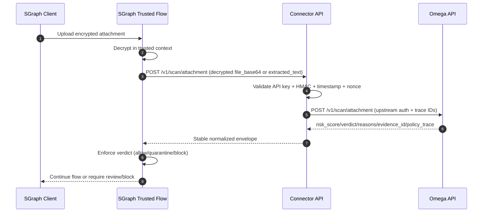
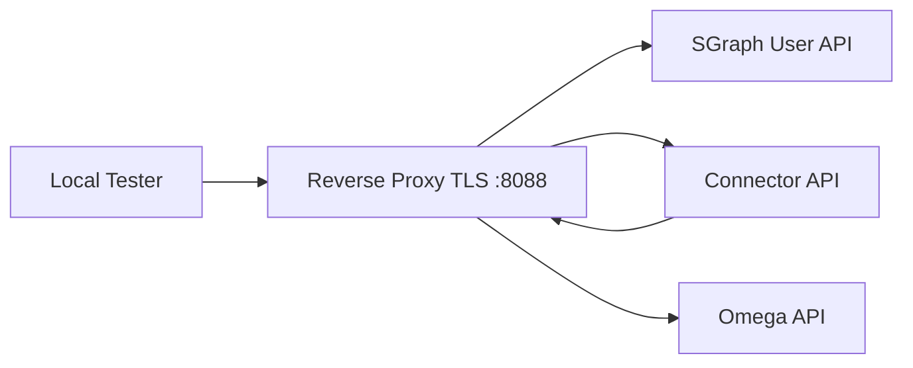
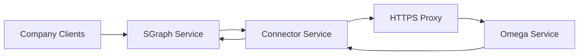

# SGraph <-> Omega Integration Architecture (Connector Hub)

## 1. Purpose

This document is the central source for how `SGraph`, `sgraph-omega-connector`, and `Omega Walls` are connected end-to-end.

It answers:

- where integration starts and ends,
- what each side must implement,
- which contract fields are mandatory,
- what security checks are required,
- how decisions (`allow|quarantine|block`) are produced and enforced.

## 2. Scope and Boundaries

In scope:

- trusted-path scanning after decrypt,
- connector API contract (v1),
- Connector -> Omega upstream transport/auth,
- decision propagation back to caller,
- local and single-host deployment topology.

Out of scope:

- encryption/decryption implementation details inside SGraph,
- Omega model internals and policy logic internals,
- cross-region multi-cluster deployment.

## 3. End-to-End Flow

## 4. Integration Stage Map

1. `SGraph decrypt stage`  
SGraph decrypts payload in trusted flow. Integration starts only after decrypt.

2. `Connector request build`  
SGraph creates connector payload with `tenant_id` and one of `file_base64|extracted_text`.

3. `Connector security gate`  
Connector validates `X-API-Key`, HMAC signature, timestamp skew, and replay nonce.

4. `Connector -> Omega scan`  
Connector forwards to Omega `/v1/scan/attachment` with upstream auth and timeout/retry policy.

5. `Decision normalization`  
Connector returns stable envelope with normalized fallback behavior on upstream failures.

6. `SGraph enforcement`  
SGraph consumes verdict:
- `allow` -> continue ingestion/agent flow.
- `quarantine` -> hold for manual review or safe flow.
- `block` -> hard deny.

## 5. Data Contract (v1)

Source of truth:

- `contracts/openapi/connector-v1.yaml`

Contract policy:

- v1 is additive-only.
- breaking changes require v2.

### 5.1 Request: `POST /v1/scan/attachment`

Headers:

- `X-API-Key` (required)
- `X-Signature` (required if HMAC enabled)
- `X-Timestamp` (required if HMAC enabled)
- `X-Nonce` (required if HMAC enabled)
- `Content-Type: application/json`

Body:

- `tenant_id` (required)
- `request_id` (optional; connector generates if missing)
- `filename` (optional)
- `mime` (optional)
- oneOf:
  - `file_base64`
  - `extracted_text`
- `metadata` (optional additive map)

### 5.2 Success Response

- `request_id: string`
- `tenant_id: string`
- `risk_score: int [0..100]`
- `verdict: allow|quarantine|block`
- `reasons: string[]`
- `evidence_id: string`
- `policy_trace: object`
- `attestation: object|null` (optional passthrough)

### 5.3 Error Envelope

- `request_id: string|null`
- `error.code: string`
- `error.message: string`
- `error.details: object`

Expected status codes:

- `400 bad_request`
- `401 unauthorized|invalid_signature|stale_timestamp`
- `403 forbidden` (debug endpoint disabled)
- `409 replay_detected`

## 6. Security Model

### 6.1 HMAC Canonical String

Newline-separated:

1. HTTP method
2. path
3. `sha256(raw_body_bytes)`
4. `tenant_id`
5. `request_id` (empty string if absent)
6. `X-Timestamp`
7. `X-Nonce`

Signature:

- `base64url(hmac_sha256(secret, canonical_string))`

### 6.2 Replay/Clock Controls

- replay key: `tenant + api_key_hash + nonce`
- nonce TTL: `NONCE_TTL_SEC`
- max clock skew: `MAX_CLOCK_SKEW_SEC`

### 6.3 Plaintext Handling

- plaintext is processed in-memory only,
- no plaintext persistence in connector,
- logs must remain redacted (`AUDIT_REDACTION=true`).

## 7. Upstream Error Classification and Fail-Mode

When Omega is unavailable or invalid:

- connector returns safe fallback verdict (default `quarantine`),
- reason is explicit:
  - `omega_timeout`
  - `omega_unavailable`
  - `omega_rejected_4xx`
  - `invalid_response`

Important:

- Omega `4xx` is classified as `omega_rejected_4xx`,
- Omega `4xx` must not open connector circuit breaker.

## 8. Deployment Topologies

### 8.1 Local Full-Loop (Compose)

### 8.2 Single-Host Server

## 9. Responsibilities by Repository

### 9.1 This Repository (`sgraph-omega-connector`)

- connector runtime API and auth,
- OpenAPI/spec and contract tests,
- local compose topology,
- integration runbooks and qualification scripts,
- upstream patch kit (copy/paste assets for SGraph/Omega PRs).

### 9.2 SGraph Repository

- hook call after decrypt and before ingestion,
- pass stable `request_id`/`tenant_id`,
- enforce returned verdict,
- keep decrypted payload inside trusted path.

Reference:

- `upstream_patches/sgraph/INTEGRATION.md`

### 9.3 Omega Repository

- provide `/v1/scan/attachment` runtime endpoint,
- enforce proxy/TLS + upstream auth config,
- align limits and env for connector upstream calls.

Reference:

- `upstream_patches/omega/INTEGRATION.md`

## 10. What Must Be Updated When Contract Changes

Mandatory synchronized updates:

- `contracts/openapi/connector-v1.yaml`
- `contracts/schemas/snapshots/*`
- `contracts/schemas/examples/*`
- `docs/CONTRACT.md`
- tests (`unit`, `integration`, `e2e`, `contract`)

Detailed policy:

- `docs/CONTRACT_CHANGE_POLICY.md`

## 11. Verification Checklist (Go/No-Go)

1. `make health` -> connector/omega/sgraph all `ok`.
2. `make smoke` -> `allow`, `quarantine`, `block` scenarios pass.
3. `RUN_COMPOSE_E2E=1 .venv/bin/pytest -s tests/e2e/test_compose_scenarios.py` -> all green.
4. `make smoke-upstream` -> real SGraph path green with saved decision JSON.
5. no plaintext leakage in logs.
6. fallback-rate acceptable on happy-path.
